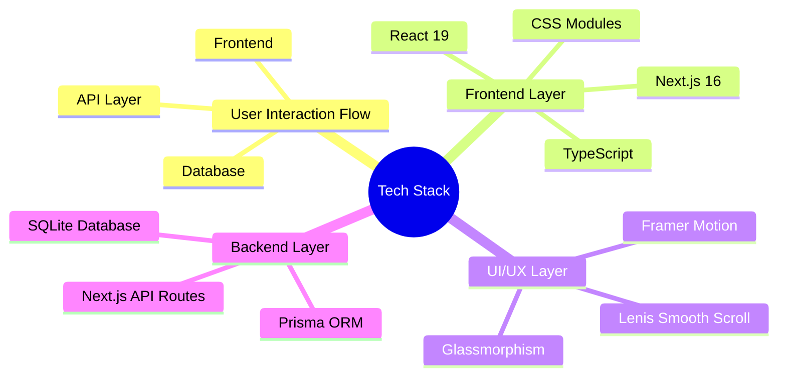
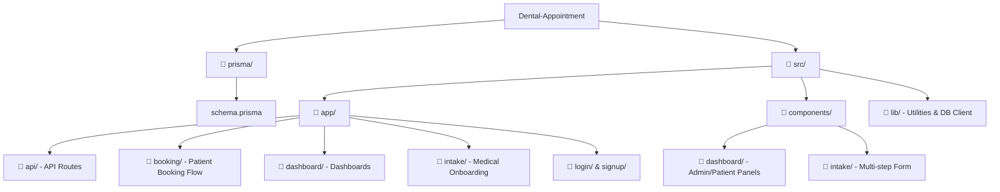
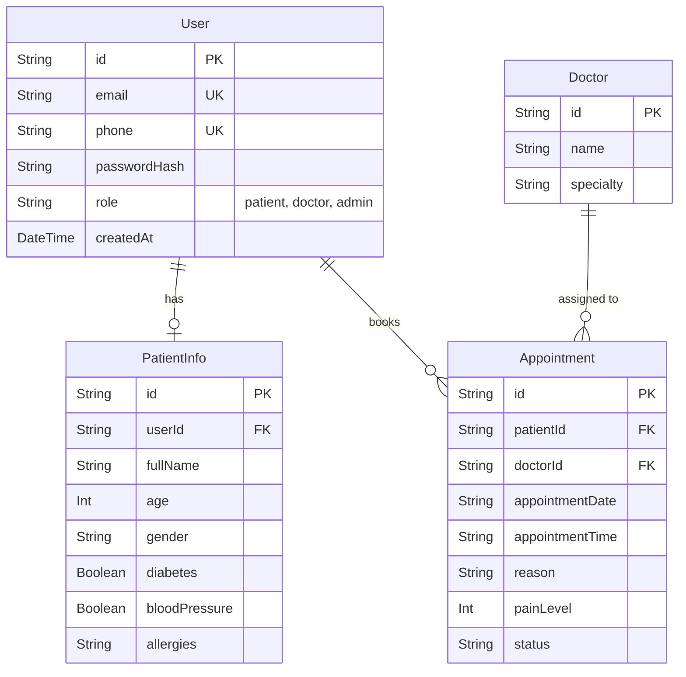
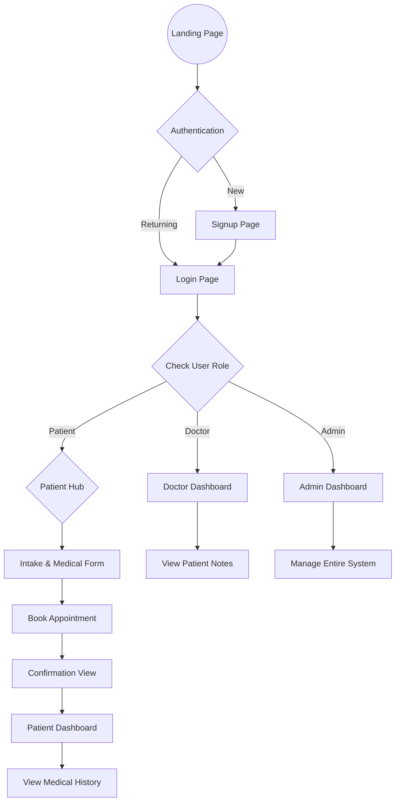

<div align="center">
  
  
  <br />
  <br />

  # 🦷 Dental Appointment SaaS

  **A premium, modern, and responsive Dental Appointment Booking System.**

  [](#)
  [](#)
  [](#)
  [](#)

  > Built with cutting-edge web technologies, featuring a dedicated patient portal, seamless authentication flows, and dynamic dashboards with a healthcare-inspired aesthetic utilizing glassmorphism and fluid animations.

</div>

<br />

---

## ✨ Key Features

### 🧑‍⚕️ For Patients
- **Sleek Intake Flow:** Painless personal and medical history onboarding.
- **Smart Booking System:** Choose preferred doctors and time slots effortlessly.
- **Patient Hub:** View upcoming appointments and historical visit data at a glance.

### 🩺 For Doctors
- **Doctor Dashboard:** See daily schedules, review patient medical notes, and assess pain levels prior to visits.

### ⚙️ For Administrators
- **Command Center:** Total system oversight, managing all appointments, patients, and platform data from one secure dashboard.

### 🎨 Premium UI/UX
- **Glassmorphism Aesthetic:** Responsive, accessible design using custom Vanilla CSS modules.
- **Fluid Motion:** Physics-based animations via **Framer Motion** and silky smooth scrolling powered by **Lenis**.

---

## 🚀 Tech Stack

We chose a robust, modern stack prioritizing performance, developer experience, and scalability.

| Category | Technology | Description |
| :--- | :--- | :--- |
| **Framework** | **[Next.js v16+](https://nextjs.org/)** | React framework with App Router for SSR and routing. |
| **UI Library** | **[React v19](https://react.dev/)** | Component-based UI development. |
| **Language** | **[TypeScript](https://www.typescriptlang.org/)** | Strongly typed JavaScript for safer code. |
| **Styling** | **Vanilla CSS Modules** | Custom styling for an authentic glassmorphism effect. |
| **Animations** | **[Framer Motion](https://www.framer.com/motion/)** | Declarative physics-based animations. |
| **Scrolling** | **[Lenis](https://lenis.studiofreight.com/)** | Lightweight smooth scroll implementation. |
| **Icons** | **[Lucide React](https://lucide.dev/)** | Clean, consistent SVG icon set. |
| **Database ORM**| **[Prisma v5](https://www.prisma.io/)** | Next-generation Node.js and TypeScript ORM. |
| **Database** | **SQLite** | Lightweight local database (`dev.db`) for rapid development. |

<details>
<summary><b>🧠 View Architecture Mindmap</b></summary>


</details>

## 🏗️ Project Architecture
A high-level view of our directory structure designed for modularity and easy maintenance:



## 🗄️ Database Schema
Here is the underlying database model powering the application data flow:



## 🔄 User Journey
How users navigate through the application ecosystem:



## 🛠️ Getting Started
Follow these instructions to get a copy of the project up and running on your local machine.

### 1. Prerequisites
Ensure you have the following installed:

* Node.js (v18 or higher)
* npm, yarn, or pnpm

### 2. Installation
Clone the repository and install the dependencies:

```bash
git clone https://github.com/yourusername/dental-appointment-saas.git
cd dental-appointment-saas
npm install
```

### 3. Environment Variables
Create a `.env` file in the root directory and configure your Prisma database URL to point to the local SQLite file:

```env
DATABASE_URL="file:./dev.db"
```

### 4. Database Setup
Generate the Prisma Client and push the schema to the SQLite database:

```bash
npx prisma generate
npx prisma db push
```

### 5. Start Development Server
Boot up the Next.js development server:

```bash
npm run dev
```

Open [http://localhost:3000](http://localhost:3000) with your browser to see the application!
